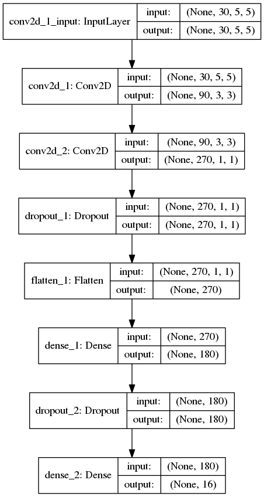
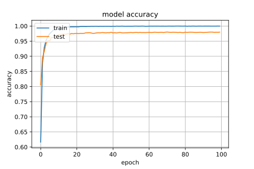
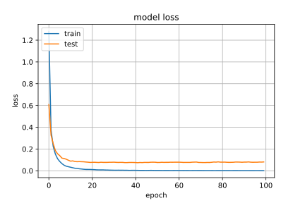
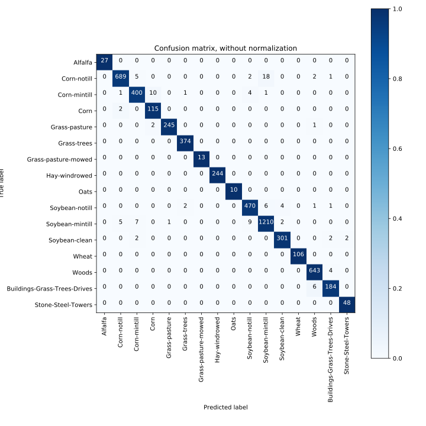
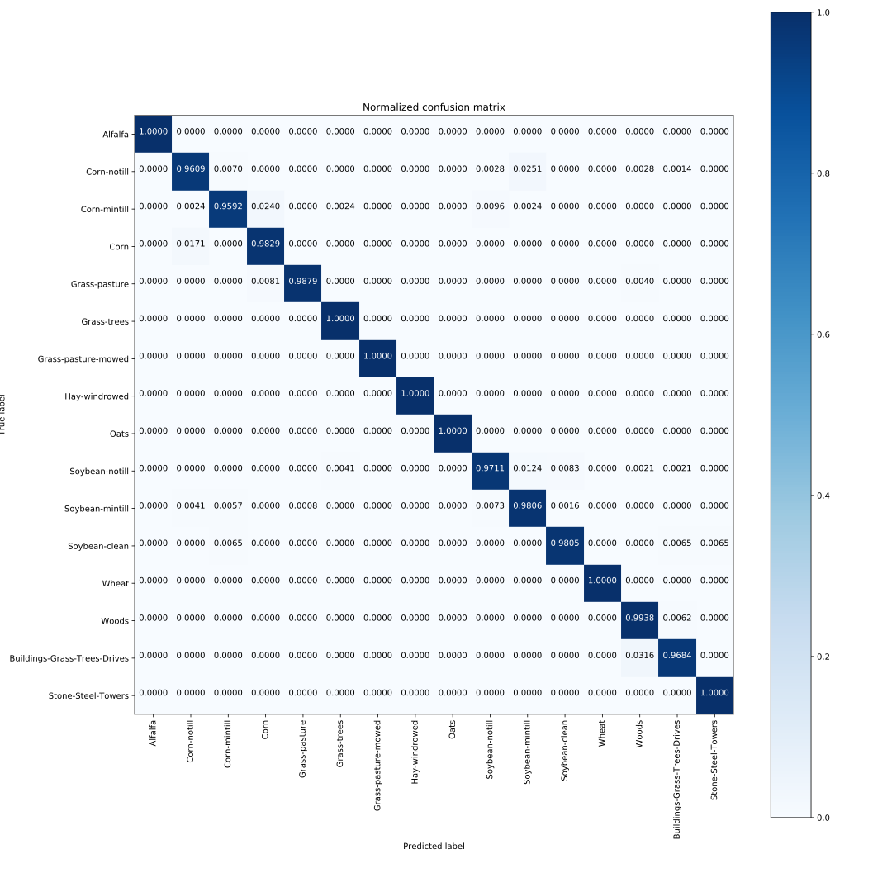
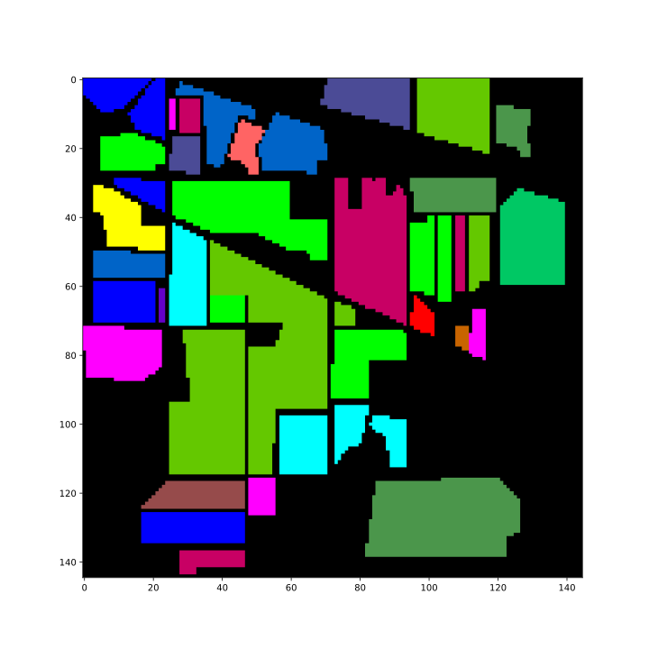
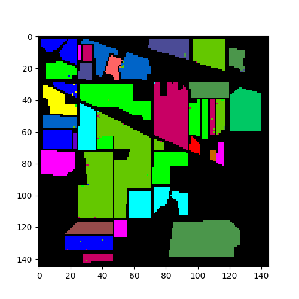

# Indian_pines_classification

### 运行环境

- Anaconda 3.6.4
- python=3.6.4
- Keras=2.1.5
- TensorFlow=1.3.0 作为keras后端
- numpy=1.14.2
- notebook=5.4.1
- ipython=6.3.1
- spectral=0.19

### 代码结构

**dataset.ipynb**

利用spectral工具包读取数据集,然后对数据集进行预处理,包括进行训练测试集分割 / 序列化和PCA变换,并将其以npy的格式保存到文件中.处理后的数据集保存在predata文件夹中.

**train.ipynb**

利用keras构建卷积神经网络模型,读取与处理的数据集进行训练.

其中训练过程,使用随机梯度下降法SGD作为优化算法,使用多分类的对数损失函数*categorical_crossentropy*作为损失函数.

使用ReduceLROnPlateau回调函数对val_acc进行监控,当val_acc不再下降时,减少学习率,直至减少到0.000001.

使用ModelCheckpoint回调函数,对有好的val_acc的训练过程作为一个检查点保存下来,下一次若有更好的结果则更新.若不好则不更新.

训练完成后保存模型到文件,并将训练过程中loss和accuarcy的变化情况绘制出来.

**test.ipynb**

对训练的模型的效果进行测试和评价.

使用sklearn包中的classification_report和confusion_matrix,总结出分类效果报告(包括Test loss Test accuracy以及对测试集中每一类样本的预测结果进行统计)和相应的混淆矩阵.

使用matplotlib工具包将混淆矩阵可视化,包括原始的混淆矩阵(数据为样本个数)以及标准化后的混淆矩阵(数据为样本比例)

最后读取原始数据集,对整个数据集进行分类,并使用spectral工具包绘制出预测结果,以高光谱图像的形式表示出来.

### 模型结构

```python
# Define the model structure
model = Sequential()

model.add(Conv2D(C1, (3, 3), activation='relu', input_shape=input_shape))
model.add(Conv2D(3*C1, (3, 3), activation='relu'))
model.add(Dropout(0.25))

model.add(Flatten())
model.add(Dense(6*numPCAcomponents, activation='relu'))
model.add(Dropout(0.5))
model.add(Dense(16, activation='softmax'))
```





### 训练结果

下图是训练和测试准确率随着epoch的变化图



下图是训练和测试损失随着epoch的变化图



### 测试结果

    Test loss 8.111980732981666 (%)
    Test accuracy 97.99344009261046 (%)
    classification result: 
                                precision    recall  f1-score   support
    
    		  		 Alfalfa       1.00      1.00      1.00        27
                 Corn-notill       0.99      0.96      0.97       717
                Corn-mintill       0.97      0.96      0.96       417
                        Corn       0.91      0.98      0.94       117
               Grass-pasture       1.00      0.99      0.99       248
                 Grass-trees       0.99      1.00      1.00       374
         Grass-pasture-mowed       1.00      1.00      1.00        13
               Hay-windrowed       1.00      1.00      1.00       244
                        Oats       1.00      1.00      1.00        10
              Soybean-notill       0.97      0.97      0.97       484
             Soybean-mintill       0.98      0.98      0.98      1234
               Soybean-clean       0.98      0.98      0.98       307
                       Wheat       1.00      1.00      1.00       106
                       Woods       0.98      0.99      0.99       647
     		 Buildings-Grass       0.96      0.97      0.96       190
               -Trees-Drives 
          Stone-Steel-Towers       0.96      1.00      0.98        48
                 avg / total       0.98      0.98      0.98      5183
下图是没有经过标准化的混淆矩阵



下图是经过标准化的混淆矩阵



下图是真实分类的高光谱图像



下图是经过上述模型分类的得到的高光谱图像




